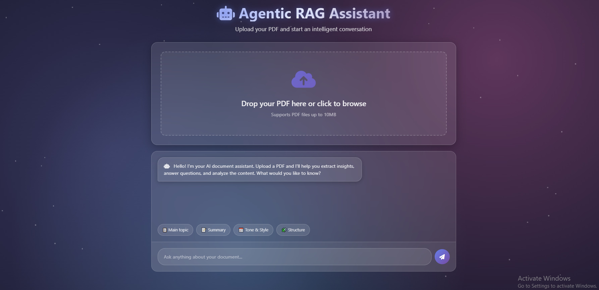

# Agentic RAG Assistant

  


  

A user-friendly web application that allows you to upload PDF documents and have an intelligent conversation with them. Using a powerful Retrieval-Augmented Generation (RAG) model, this tool helps you extract insights, summarize content, and get answers to your specific questions about the document.

  
## ✨ Features

  

* **Intuitive Interface:** A sleek, modern, and easy-to-navigate web UI.

* **PDF Upload:** Simply drag and drop or browse to upload your PDF file.

* **Intelligent Q&A:** Ask questions in natural language and get accurate, context-aware answers based on the document's content.

* **RAG-Powered Backend:** Leverages the power of CrewAI and advanced language models to understand and process your documents.

* **Pre-set Suggestions:** Quick-start your analysis with suggested questions like summarizing the document or identifying its main topics.

  

## 🛠️ Tech Stack

  

* **Backend:** Flask, CrewAI

* **LLM Provider:** Groq

* **Vector Database:** ChromaDB

* **Embedding Model:** Sentence-Transformers

* **Frontend:** HTML, CSS, JavaScript

* **Deployment:** Python

  

## 🧠 Core Technologies Explained

  

This project is built on the powerful `CrewAI` framework and its `RagTool` to create an intelligent document analysis agent.

  

* **CrewAI:** This is a framework for orchestrating role-playing, autonomous AI agents. In this project, we define a "Knowledge Expert" agent whose goal is to answer questions based on the document. CrewAI manages the agent, its tools, and the tasks it needs to perform, allowing for complex workflows to be handled seamlessly.

  

* **RagTool (Retrieval-Augmented Generation):** This specialized tool from `crewai-tools` is the heart of our document interaction. Here’s how it works:

1. **Indexing:** When you upload a PDF, the `RagTool` processes it, breaks it down into manageable chunks, and converts those chunks into numerical representations (embeddings). These are stored in a vector database (ChromaDB).

2. **Retrieval:** When you ask a question, the tool searches the vector database to find the most relevant chunks of text from the original document.

3. **Generation:** The retrieved text chunks are then passed along with your question to the Large Language Model (LLM). This gives the model the specific context it needs to generate a highly relevant and accurate answer, rather than relying solely on its general knowledge.

  

This RAG approach ensures that the answers are grounded in the content of your uploaded document.

  

## 🚀 Getting Started

  

Follow these instructions to get a copy of the project up and running on your local machine for development and testing purposes.

  

### Prerequisites

  

* Python 3.8 or higher

* An API key from [Groq](https://console.groq.com/keys)

  

### Installation

  

1. **Clone the repository:**

```sh

git clone [https://github.com/your-username/your-repository-name.git](https://github.com/your-username/your-repository-name.git)

cd your-repository-name

```

  

2. **Create a virtual environment:**

This keeps your project dependencies isolated.

```sh

# For Windows

python -m venv venv

venv\Scripts\activate

  

# For macOS/Linux

python3 -m venv venv

source venv/bin/activate

```

  

3. **Install the required packages:**

Create a file named `requirements.txt` and add the following lines:

```

flask

python-dotenv

werkzeug

crewai

crewai-tools

groq

chromadb

sentence-transformers

pypdf

```

Then, run this command to install them:

```sh

pip install -r requirements.txt

```

  

4. **Set up your environment variables:**

Create a file named `.env` in the root of your project directory and add your API key:

```

GROQ_API_KEY="your-groq-api-key-here"

SECRET_KEY="a-strong-and-random-secret-key"

```

  

### Running the Application

  

1. Execute the main application file:

```sh

python app.py

```

  

2. Open your web browser and go to:

```

[http://127.0.0.1:5000](http://127.0.0.1:5000)

```

  

## Usage

  

1. **Upload a PDF:** Drag and drop a PDF file into the upload zone or click to browse your files.

2. **Wait for Processing:** The system will embed the document's content. You'll see a success message when it's ready.

3. **Ask Questions:** Type your questions into the chat box at the bottom and press Enter or click the send button.

4. **Get Answers:** The AI assistant will provide answers based on the information in the uploaded PDF.

  

## 📂 Project Structure

  

```

.

├── uploads/ # Folder for storing uploaded PDFs

├── templates/

│ └── index.html # Main HTML file for the UI

├── .env # Environment variables (API keys)

├── app.py # Main Flask application logic

├── requirements.txt # Python dependencies

└── README.md # You are here!

```
</p>